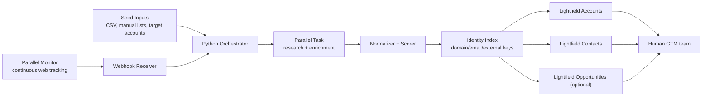

# Lightfield + Parallel Prospect Automation Design

## Goal

Design a Python-first automation that:

1. Discovers new prospects
2. Monitors the web for prospect-relevant changes
3. Enriches accounts and key contacts with structured research
4. Uploads and updates records in Lightfield reliably

This proposal follows the same operating pattern described in the Modal case study:

- code-first workflows
- versioned prompts and schemas
- structured outputs
- continuous monitoring feeding CRM updates
- explicit cost and quality control

## Why This Design Fits Your Stack

The current workspace already looks like a code-first prospecting workflow rather than a traditional app repo:

- [`enrich_decision_makers.py`](/Users/servandodavidtorresgarcia/Servando/controlthrive/internal/outreach/enrich_decision_makers.py)
- [`master_merged_agents_contacts_crm_import.csv`](/Users/servandodavidtorresgarcia/Servando/controlthrive/internal/outreach/master_merged_agents_contacts_crm_import.csv)
- [`summary_final.md`](/Users/servandodavidtorresgarcia/Servando/controlthrive/internal/outreach/summary_final.md)

That makes an external Python orchestrator the best default. We can keep Lightfield as the system of record, Parallel as the discovery/research layer, and a small Python service as the control plane.

## Source-Backed Constraints

These constraints shape the design:

- Lightfield account and contact list endpoints are paginated with `limit` and `offset`, max `25`, and the general list methods guide documents field-level filtering.
- Lightfield account create requires `$name`.
- Lightfield account create/update accepts `fields` plus `relationships`, and `SINGLE_SELECT` / `MULTI_SELECT` values can be passed as option labels or option IDs discovered from definitions.
- Lightfield account creation triggers background enrichment when `$website` is present.
- Lightfield contact creation triggers background enrichment after create.
- Lightfield contact `$name` is an object with `firstName` and `lastName`, not a single string.
- Lightfield opportunity creation requires `$name`, `$stage`, and the `$account` relationship.
- Lightfield definitions endpoints should be used to discover field keys, relationship keys, and select options before writing data.
- Lightfield workflows support scheduled triggers, webhooks, HTTP steps, object operations, and agent steps.
- Parallel Task is designed for natural-language or structured research with structured outputs, citations/confidence, processor control, streaming events, and webhooks.
- Parallel Monitor is designed for ongoing web tracking with scheduled execution plus webhook notifications.
- Parallel Monitor works best with intent-heavy natural-language queries, should not be used for historical backfills, and should not include fixed dates in the query.

One implementation caveat:

- Parallel’s Monitor quickstart and API reference appear to use slightly different naming in docs. The quickstart language emphasizes scheduled monitors and webhook notifications, while the current API reference page for create-monitor documents a `cadence` field with values like `daily`, `weekly`, `hourly`, and `every_two_weeks`. I would treat the API reference as the implementation contract and verify it again on implementation day.

## High-Level Architecture



## Recommended System Shape

### 1. Discovery Lane

Use three lightweight operator modes:

- query-first discovery from natural-language search
- optional batch backfill from a seed CSV
- continuous refresh from Monitor events

Query-first discovery is the default entry point.
CSV backfill is optional.
Monitor is for refresh, not historical discovery.

### 2. Research Lane

Use Parallel Task to turn raw company inputs into a structured prospect profile with:

- normalized company identity
- website and LinkedIn
- industry and headcount band
- funding status and last funding type
- fit score and fit rationale
- triggering event summary
- top decision-makers
- source URLs / citations

### 3. CRM Sync Lane

Use the Lightfield Python SDK to:

- create or update accounts
- create or update contacts
- link contacts to accounts
- optionally create opportunities for high-fit accounts

### 4. Local Control Plane

Maintain a local identity index in Python for deterministic matching, dedupe, replay safety, and protection against list-index staleness.

That local store should track:

- normalized domain
- normalized company name
- Lightfield account ID
- Lightfield contact IDs
- external monitor ID
- latest event hash
- prompt version
- last sync timestamp

## Python Package Layout

```python
automation/
    __init__.py
    config.py
    main.py
    db.py
    logging.py

    clients/
        __init__.py
        lightfield_client.py
        parallel_task_client.py
        parallel_monitor_client.py

    models/
        __init__.py
        prospect.py
        crm_sync.py
        events.py

    services/
        __init__.py
        definitions_service.py
        identity_index_service.py
        discovery_service.py
        enrichment_service.py
        scoring_service.py
        lightfield_sync_service.py
        opportunity_service.py

    jobs/
        __init__.py
        seed_discovery.py
        refresh_identity_index.py
        replay_failed_events.py
        reconcile_lightfield_enrichment.py

    api/
        __init__.py
        webhooks.py
```

## Core Data Contracts

Use Pydantic models so prompts, monitor events, and CRM writes all share the same schema.

```python
from pydantic import BaseModel, HttpUrl, Field
from typing import Literal


class DecisionMaker(BaseModel):
    full_name: str | None = None
    title: str | None = None
    email: str | None = None
    linkedin_url: HttpUrl | None = None
    confidence: float | None = None


class ProspectProfile(BaseModel):
    company_name: str
    website: HttpUrl | None = None
    linkedin_company_url: HttpUrl | None = None
    country: str | None = None
    industry: list[str] = Field(default_factory=list)
    employee_count_band: str | None = None
    total_funding: str | None = None
    last_funding_type: str | None = None
    trigger_summary: str | None = None
    fit_score: int
    fit_bucket: Literal["low", "medium", "high"]
    fit_reason: str
    prompt_version: str
    source_urls: list[HttpUrl] = Field(default_factory=list)
    decision_makers: list[DecisionMaker] = Field(default_factory=list)


class IdentityRecord(BaseModel):
    normalized_domain: str | None = None
    normalized_company_name: str
    lightfield_account_id: str | None = None
    external_company_key: str
```

## Prospect Discovery Design

### Batch Discovery

Use Task API for batch enrichment against seeds such as:

- manually curated company lists
- CSV exports
- competitor/account lists
- current spreadsheets of targets

Recommended batch input:

- `company_name`
- `website`
- `country` if known
- `seed_source`
- `campaign_name`

Recommended Task output schema:

- `normalized_company_name`
- `website`
- `linkedin_company_url`
- `industry`
- `employee_count_band`
- `total_funding`
- `last_funding_type`
- `fit_score`
- `fit_reason`
- `decision_makers`
- `source_urls`

This mirrors the Modal pattern:

- structured inputs
- structured outputs
- prompt versioning
- no post-processing guesswork

### Continuous Discovery

Use Parallel Monitor to discover new prospects from web events.

Recommended monitor categories:

- fundraising events
- hiring signals
- product launches
- new market/category expansion
- competitor customer wins
- regulatory or industry events relevant to your ICP

Example monitor queries:

- `"Funding announcements for B2B AI companies in Europe and North America"`
- `"New product launches by companies building AI developer tools"`
- `"Hiring announcements for VP Sales, RevOps, or SDR leadership at AI infrastructure startups"`
- `"News and announcements about [your ICP category] companies expanding into enterprise sales"`

Important Monitor guidance from the docs:

- write intent-heavy natural-language queries
- do not use it for historical research
- do not put fixed dates in the query text

## Enrichment Design

Every discovered prospect should go through a second structured research pass before CRM sync.

### Why Two Passes

Monitor is best for event detection.
Task is best for full structured enrichment.

So the correct pattern is:

1. Monitor detects a relevant company/event
2. Python receives the webhook
3. Python calls Task to build the normalized prospect profile
4. Python syncs Lightfield

### Prompt Versioning

Store a `prompt_version` for every enrichment run.

Use semantic versions like:

- `prospect_profile_v1`
- `prospect_profile_v1_1`
- `decision_makers_v2`

Store that version:

- in your local database
- in a Lightfield custom field on the account

This directly follows the Modal case study pattern and makes it easy to:

- compare output quality over time
- rerun only stale records
- explain why older records have different shapes

## Lightfield Sync Design

### Objects To Use

- `Account` is the primary object
- `Contact` stores decision-makers
- `Opportunity` is optional for high-fit prospects

### Definitions-First Bootstrapping

At startup, fetch:

- account definitions
- contact definitions
- opportunity definitions

Use those definitions to resolve:

- custom field slugs
- relationship keys
- select option IDs
- read-only fields you must not write

Do not hardcode select option IDs.

### Recommended Lightfield Custom Fields

Account custom fields:

- `external_company_key`
- `parallel_prompt_version`
- `parallel_fit_score`
- `parallel_fit_bucket`
- `parallel_fit_reason`
- `parallel_trigger_summary`
- `parallel_total_funding`
- `parallel_last_funding_type`
- `parallel_last_monitor_event_at`
- `parallel_last_monitor_id`
- `parallel_last_event_hash`
- `parallel_source_urls`

Contact custom fields:

- `parallel_role_confidence`
- `linkedin_url`
- `source_urls`

If you prefer fewer custom fields, collapse the research payload into one markdown/text field like `parallel_research_summary`, and keep the detailed JSON in your local database.

### Upsert Strategy

Because the documented Lightfield list endpoints do not expose search filters, use this matching order:

1. `external_company_key`
2. normalized domain
3. normalized company name as a fallback review path

For contacts:

1. normalized email
2. normalized LinkedIn URL if stored
3. `(account_id, normalized full name)` as a low-confidence fallback

### Idempotency Strategy

Use Lightfield’s `Idempotency-Key` header on create and update writes.

Recommended key format:

```python
f"{object_type}:{external_key}:{payload_hash}:{prompt_version}"
```

That gives you safe retries when:

- Parallel webhooks are retried
- the network drops mid-write
- your worker restarts

## CRM Write Rules

### Account Writes

On create:

- set `$name`
- set `$website` if known
- set `$linkedIn` if known
- set `$industry` and `$headcount` only after resolving valid option values from definitions
- set custom scoring and provenance fields

On update:

- patch only changed fields
- avoid clearing fields unless you explicitly decide null is authoritative
- use relationship operations to add/remove contacts safely

### Contact Writes

On create:

- split person name into `firstName` / `lastName`
- set `$email` as a list
- link to the account through `$account`

On update:

- append new email if it is genuinely new
- never replace the full email list unless you are certain

### Opportunity Writes

Create an opportunity only when:

- fit score is above a threshold
- a strong trigger event exists
- the account is not already open in an active pipeline

Because opportunity stages are workspace-specific, resolve the stage from the opportunity definitions endpoint before writing.

## Identity Index Design

Use SQLite first, then move to Postgres if volume grows.

Recommended tables:

- `accounts_index`
- `contacts_index`
- `monitor_events`
- `task_runs`
- `sync_runs`
- `dead_letter_queue`

The identity index solves the biggest practical CRM sync issue in this design:

- Lightfield is the source of truth
- your local DB is the source of matching truth

That means CRM writes stay deterministic even if the CRM API remains list-oriented rather than search-oriented.

## Python Runtime Design

### Option A: Small Service

Use:

- `FastAPI` for webhook ingestion
- `APScheduler` or external cron for scheduled jobs
- `httpx` for Parallel wrappers if you do not use an official Python client
- Lightfield Python SDK for CRM writes
- `Pydantic` for schemas
- `SQLAlchemy` for local persistence
- `tenacity` for retries

This is the simplest all-Python deployment.

### Option B: Job + Webhook Split

Use:

- one scheduled worker for batch discovery
- one web service for Parallel Monitor webhooks

This is better if you deploy to serverless/container infrastructure.

## Recommended Processing Flow

### Flow 1: Initial Backfill

1. Read seed CSV or manual target list
2. Normalize domains and company names
3. Send batches to Parallel Task with a structured output schema
4. Score and validate results
5. Upsert accounts to Lightfield
6. Upsert contacts to Lightfield
7. Optionally create opportunities for high-fit accounts

### Flow 2: Continuous Monitoring

1. Create Monitor definitions for each ICP/region/signal cluster
2. Store the returned monitor ID and metadata in the local DB
3. Receive webhook notification when a monitor event is detected
4. Deduplicate the event using an event hash
5. Run Task enrichment on the detected company/event
6. Update the Lightfield account and linked contacts
7. Optionally create or update an opportunity

### Flow 3: Reconciliation

Run a daily reconciliation job that:

- refreshes Lightfield account/contact indexes
- checks failed syncs
- reruns stale accounts whose prompt version is outdated
- pulls Lightfield-enriched fields if you want to merge them back into your local store

## Suggested Scoring Model

Keep scoring deterministic in Python, not inside the CRM.

Suggested dimensions:

- `firmographic_fit`
- `trigger_strength`
- `decision_maker_coverage`
- `data_confidence`

Example:

```python
def compute_fit_score(
    firmographic_fit: int,
    trigger_strength: int,
    contact_coverage: int,
    data_confidence: int,
) -> int:
    return round(
        firmographic_fit * 0.35
        + trigger_strength * 0.30
        + contact_coverage * 0.20
        + data_confidence * 0.15
    )
```

Then map:

- `0-49 -> low`
- `50-74 -> medium`
- `75-100 -> high`

## Recommended Failure Handling

Create a dead-letter queue entry when:

- Task output is malformed
- domain matching is ambiguous
- multiple Lightfield accounts plausibly match the same prospect
- a required Lightfield select option cannot be resolved
- webhook replay produces a conflicting event state

Do not silently drop these.

## Recommended Human Review Gates

Auto-create records when:

- the domain is clear
- fit score is high enough
- at least one decision-maker is present

Route to review when:

- no website exists
- two domains compete for the same company
- contact identity is inferred but email is missing
- the company may already exist under a different brand name

## Optional Hybrid With Lightfield Workflows

If you want deeper CRM-native behavior later, a good hybrid model is:

- keep prospect discovery and enrichment in Python
- let Lightfield workflows handle internal follow-up rules

Examples:

- when a new account with `parallel_fit_bucket = high` is created, assign owner
- when a monitored account gets a new funding trigger, open an opportunity
- when a decision-maker contact is added, notify a rep or launch downstream automation

I would not start there.
The external Python control plane is easier to test and version.

## Biggest Risks

- Lightfield’s documented public list endpoints do not currently show server-side search filters, so identity matching must be solved locally.
- Lightfield background enrichment may later add or change fields on accounts and contacts, so you need a source-of-truth policy for merge conflicts.
- Public Lightfield API docs surfaced account, contact, opportunity, member, and workflow-run resources. I did not see public note/task endpoints in the pages reviewed, so activity logging may need to live in custom fields, opportunities, or Lightfield workflows unless additional endpoints exist elsewhere in the docs.
- Parallel Monitor documentation appears to describe the same feature in both quickstart and API reference, but the exact request field naming should be rechecked right before implementation.

## Recommended Build Order

1. Build the Lightfield definitions loader and identity index
2. Build batch Task enrichment for a CSV seed file
3. Sync accounts and contacts into Lightfield
4. Add Monitor webhooks for continuous updates
5. Add opportunity creation rules
6. Add reconciliation and dead-letter replay

## Questions To Confirm Before Implementation

- What is your ICP exactly: industry, company size, geography, trigger signals?
- Do you want automatic opportunity creation, or only accounts and contacts?
- Which Lightfield custom fields already exist, if any?
- Do you want owner assignment logic in Python or inside Lightfield workflows?
- Do you want to keep full research payloads only in Python storage, or also write a summarized version into Lightfield?

## My Recommendation

Build this as a small Python service with:

- Parallel Monitor for ongoing event detection
- Parallel Task for structured enrichment
- Lightfield Python SDK for writes
- a local SQLite/Postgres identity index for deterministic upserts
- prompt versioning from day one

That gives you the same core operating model Modal used:

- code-first
- structured outputs
- continuous discovery
- CRM sync
- easy iteration without rebuilding the whole pipeline

## Sources

- Lightfield Python API library: [https://lightfield.stldocs.app/api/python/index.md](https://lightfield.stldocs.app/api/python/index.md)
- Lightfield Workflows overview: [https://lightfield.stldocs.app/workflows/overview/index.md](https://lightfield.stldocs.app/workflows/overview/index.md)
- Lightfield API reference index: [https://lightfield.stldocs.app/api](https://lightfield.stldocs.app/api)
- Lightfield account list: [https://lightfield.stldocs.app/api/resources/account/methods/list/index.md](https://lightfield.stldocs.app/api/resources/account/methods/list/index.md)
- Lightfield account definitions: [https://lightfield.stldocs.app/api/resources/account/methods/definitions/index.md](https://lightfield.stldocs.app/api/resources/account/methods/definitions/index.md)
- Lightfield account create: [https://lightfield.stldocs.app/api/resources/account/methods/create/index.md](https://lightfield.stldocs.app/api/resources/account/methods/create/index.md)
- Lightfield account update: [https://lightfield.stldocs.app/api/resources/account/methods/update/index.md](https://lightfield.stldocs.app/api/resources/account/methods/update/index.md)
- Lightfield contact list: [https://lightfield.stldocs.app/api/resources/contact/methods/list/index.md](https://lightfield.stldocs.app/api/resources/contact/methods/list/index.md)
- Lightfield contact create: [https://lightfield.stldocs.app/api/resources/contact/methods/create/index.md](https://lightfield.stldocs.app/api/resources/contact/methods/create/index.md)
- Lightfield contact update: [https://lightfield.stldocs.app/api/resources/contact/methods/update/index.md](https://lightfield.stldocs.app/api/resources/contact/methods/update/index.md)
- Lightfield opportunity create: [https://lightfield.stldocs.app/api/resources/opportunity/methods/create/index.md](https://lightfield.stldocs.app/api/resources/opportunity/methods/create/index.md)
- Lightfield opportunity definitions: [https://lightfield.stldocs.app/api/resources/opportunity/methods/definitions/index.md](https://lightfield.stldocs.app/api/resources/opportunity/methods/definitions/index.md)
- Parallel case study: [https://parallel.ai/blog/case-study-modal](https://parallel.ai/blog/case-study-modal)
- Parallel Task quickstart: [https://docs.parallel.ai/task-api/task-quickstart](https://docs.parallel.ai/task-api/task-quickstart)
- Parallel Task enrichment quickstart: [https://docs.parallel.ai/task-api/examples/task-enrichment](https://docs.parallel.ai/task-api/examples/task-enrichment)
- Parallel Monitor quickstart: [https://docs.parallel.ai/monitor-api/monitor-quickstart](https://docs.parallel.ai/monitor-api/monitor-quickstart)
- Parallel create-monitor reference: [https://docs.parallel.ai/api-reference/monitor/create-monitor](https://docs.parallel.ai/api-reference/monitor/create-monitor)
