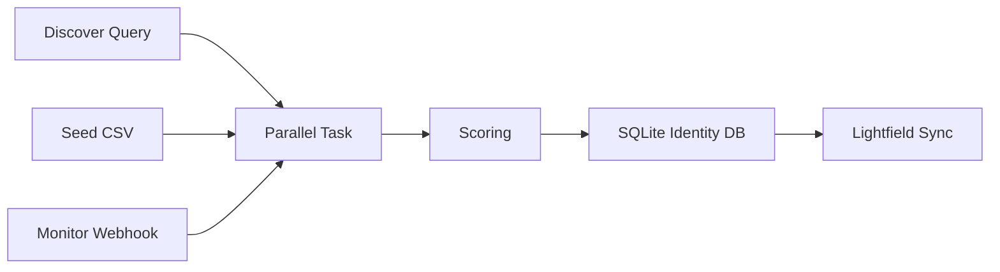

# Plug-And-Play Manual

## What This System Is

This is a lightweight Python control plane that connects:

- Parallel Task for discovery and enrichment
- Parallel Monitor for refresh events
- Lightfield for CRM storage

It supports 3 operator modes:

1. `discover`: search for new firms and contacts from a plain-English query
2. `backfill`: enrich an existing CSV if you already have one
3. `monitor-create`: keep selected accounts fresh after they are in Lightfield
4. `prospecting-review`: build ICP-qualified review files before anything is sent to Lightfield

The CSV is optional. The default front door is `discover`.

## The Rule

If a non-technical operator cannot run this from one command and understand what happened, the design is too heavy.

## What Parallel Does

Parallel is the research layer.

- `discover` uses Parallel Task to find new target firms from your query
- `backfill` uses Parallel Task to turn seed firms into structured profiles
- `prospecting-review` uses FindAll/Search for discovery, Extract for evidence gathering, and Task for strict synthesis
- `monitor-create` uses Parallel Monitor to watch already-tracked accounts for new changes

Lightfield is the CRM system of record. Python handles scoring, dedupe, and upsert logic.

## What Gets Written To Lightfield

`v1` writes only:

- `Accounts`
- `Contacts`

It does not auto-create opportunities yet.

## Minimal Architecture



## Why This Stays Lightweight

`v1` includes:

- one CLI
- one `.env`
- one local SQLite file
- one FastAPI webhook app
- one Modal app wrapper

`v1` avoids:

- Lightfield workflow sprawl
- multiple databases
- opportunity automation
- custom dashboards
- brittle no-code branching

## Setup

### 1. Install

```bash
uv sync
```

### 2. Configure

Create `.env` from [`.env.example`](/Users/servandodavidtorresgarcia/Servando/controlthrive/internal/outreach/.env.example).

Minimum useful values:

```env
LIGHTFIELD_API_KEY=...
PARALLEL_API_KEY=...
PARALLEL_WEBHOOK_SECRET=...
DRY_RUN=true
SEED_CSV=master_merged_agents_contacts_crm_import.csv
PROMPT_VERSION=prospect_profile_v1
```

Use `DRY_RUN=true` while validating. Change it to `false` when you want webhook-driven monitor refreshes to write live records too.

Optional default CSV:

- [`master_merged_agents_contacts_crm_import.csv`](/Users/servandodavidtorresgarcia/Servando/controlthrive/internal/outreach/master_merged_agents_contacts_crm_import.csv)

## Operator Commands

### Discover New Prospects

Dry run:

```bash
uv run prospect-engine discover \
  --query "Find boutique placement agents, PE capital advisory firms, and small VC firms in the US and Europe that likely need outbound prospecting help." \
  --limit 10 \
  --dry-run
```

Live run:

```bash
uv run prospect-engine discover \
  --query "Find boutique placement agents, PE capital advisory firms, and small VC firms in the US and Europe that likely need outbound prospecting help." \
  --limit 10 \
  --live
```

What happens:

- Parallel Task returns candidate firms
- each firm is enriched into a structured profile
- Python scores outbound fit
- Lightfield gets clean `Accounts` and `Contacts`
- SQLite stores identity mappings to prevent duplicates

### Build Prospecting Review Lists

Default review run for the two placement-agent lists:

```bash
uv run prospect-engine prospecting-review --generator core
```

Cheap smoke test:

```bash
uv run prospect-engine prospecting-review --generator preview
```

Custom ICP config:

```bash
uv run prospect-engine prospecting-review \
  --config prospecting_lists.example.json \
  --output-dir exports/prospecting_reviews \
  --generator core
```

What happens:

- FindAll discovers a broad candidate pool for each list
- Search gathers supporting pages for each candidate
- Extract pulls relevant evidence from those pages
- Task turns the evidence into strict structured fields
- Python applies hard filters for firm type, geography, headcount, active status, and contact completeness
- Review CSV/JSON files are written locally
- Nothing is written to Lightfield

The default lists require every approved prospect to have a decision-maker contact with both email and LinkedIn.

After review, sync one approved JSON file in dry-run mode:

```bash
uv run prospect-engine prospecting-sync-approved \
  --review-json exports/prospecting_reviews/placement_agents_europe_london_review.json \
  --dry-run
```

Write approved prospects to Lightfield only after review:

```bash
uv run prospect-engine prospecting-sync-approved \
  --review-json exports/prospecting_reviews/placement_agents_europe_london_review.json \
  --live
```

### Backfill A CSV

Dry run:

```bash
uv run prospect-engine backfill --limit 25 --dry-run
```

Live run:

```bash
uv run prospect-engine backfill --limit 25 --live
```

Custom file:

```bash
uv run prospect-engine backfill --csv your-seed-file.csv --limit 25 --live
```

Minimum CSV columns:

- `Account name`
- `Account website`

### Create A Monitor

Create account-level refresh monitoring after an account is already in Lightfield:

```bash
uv run prospect-engine monitor-create \
  --company-name "Black Isle Capital Partners" \
  --website "https://blackislecp.com" \
  --webhook-url "https://your-domain.com/webhooks/parallel"
```

What happens:

- Parallel Monitor watches for new fund activity, mandates, hiring, expansion, and similar signals
- Monitor webhooks trigger a new enrichment pass
- the existing Lightfield record is refreshed instead of duplicated

### Run The Webhook Server Locally

```bash
uv run prospect-engine serve-webhooks
```

Health check:

```text
GET /healthz
```

Monitor webhook endpoint:

```text
POST /webhooks/parallel
```

## What The System Stores Locally

The SQLite identity DB keeps:

- company external keys
- normalized domains
- Lightfield account IDs
- contact identity mappings
- processed webhook/event IDs
- sync runs
- dead letters

This exists for deterministic dedupe and replay safety, not because Lightfield lacks filtering.

## Sync Rules

Account matching order:

1. local identity DB
2. Lightfield custom external key field, if present
3. Lightfield website search
4. Lightfield exact account name

Contact matching order:

1. local identity DB
2. Lightfield email search
3. Lightfield LinkedIn custom field, if present
4. otherwise create

All live writes use Lightfield idempotency keys.

## Recommended Operating Pattern

Use the system like this:

1. run `discover` to find net-new firms
2. review the created records in Lightfield
3. use `backfill` only when you already have seed data
4. create monitors only for firms you want to keep warm

This keeps the product easy to explain:

- `discover` finds
- `backfill` imports
- `monitor` refreshes

## What Good Looks Like

A good `v1` looks like this:

- setup takes minutes
- the first 10-25 records sync without duplicates
- rerunning the same batch is safe
- contacts link to the right account
- monitor refreshes update existing records
- failures are visible and retryable
